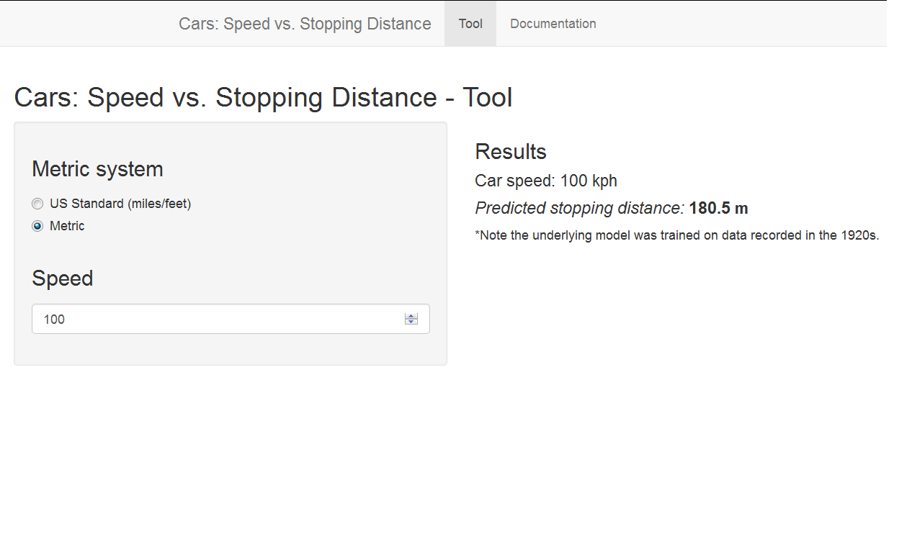

Cars: Speed vs. Stopping Distance
========================================================

Based on Cars dataset: 50 observations from the 1920s


author: Ilia Semenov 

date: Feb 2016

Overview
========================================================

**Cars: Speed vs. Stopping Distance** is:

- The webpage developed in *R* and *Shiny* that provides an estimate of vehicle 
stopping distance based on the vehicle speed provided by user and in the metric 
system chosen by user.
- Simple algorithm based on a linear regression model trained on the Cars dataset 
available in R and containing 50 observations from the 1920s.
- Beautiful web interface developed with Shiny.

Web Interface
========================================================



Data - The Cars Dataset: Summary
========================================================


```
     speed           dist       
 Min.   : 4.0   Min.   :  2.00  
 1st Qu.:12.0   1st Qu.: 26.00  
 Median :15.0   Median : 36.00  
 Mean   :15.4   Mean   : 42.98  
 3rd Qu.:19.0   3rd Qu.: 56.00  
 Max.   :25.0   Max.   :120.00  
```

```
  speed dist
1     4    2
2     4   10
3     7    4
4     7   22
5     8   16
6     9   10
```

Data - The Cars Dataset: Plot
========================================================

 


Model
========================================================

- Simple linear regression model (lm).
- distance=b*(speed)^2
- Regression through origin (no intercept).
- Significant coefficient, 0.9025 Adj. R-Squared.


```r
mod.lm<-lm(dist~I(speed^2)-1,data=cars)
# function used in the web app
dist_pred<-function (s) predict(mod.lm,data.frame(speed=s))
# coefficient for speed^2
summary(mod.lm)$coefficients[,1]
```

```
[1] 0.1533738
```
